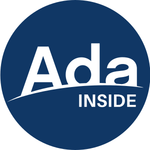
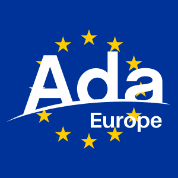
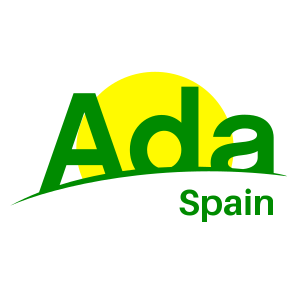

<link rel="stylesheet" href="https://www.w3schools.com/lib/w3.css">

  

    <svg id="svg_root" viewBox="0 0 300 300" xmlns="http://www.w3.org/2000/svg">
      <rect id="svg_frame" width="300" height="300" style="fill:none;stroke-width:10" stroke="black"/>
      <!-- <circle id="svg_circle_frame" cx="150" cy="150" r="148" style="fill:none;stroke-width:5" stroke="black"/> -->
      <g transform="translate(8, 40)">
        <g transform="matrix(1.3333333,0,0,-1.3333333,0,199.99999)" id="g10">
          <g transform="scale(0.095)">
            <path id="svg_logo" fill="black"
                  style="fill-opacity:1;fill-rule:nonzero;stroke:none;stroke-width:0.79978472"
                  d="m 1735.94,608.49687 c 0,38.89593 40.941,53.21687 107.491,60.38695 55.2652,6.13914 99.2853,15.35507 127.9496,33.7789 v -49.13077 c 0,-58.64022 -49.3706,-87.16455 -115.2809,-93.67799 -26.8888,2.49933 -55.0253,4.84269 -84.2414,6.98213 -22.7299,8.66966 -35.9183,23.40009 -35.9183,41.66078 z M 461.48704,591.09515 h 283.55808 l 23.26574,-68.80948 C 646.26531,500.07325 524.76681,470.81552 407.55436,433.93505 Z M 602.76101,1008.7364 702.04709,716.99567 H 503.45974 Z M 1233.3232,862.35414 c 74.732,0 135.1237,-67.56661 135.1237,-151.49682 0,-59.35602 -31.7914,-110.48307 -77.6991,-134.22627 -34.5746,-1.15649 -69.5972,-2.74967 -104.9637,-4.81151 -51.1783,20.68164 -87.5764,73.93291 -87.5764,139.03778 0,85.98246 60.3917,151.49682 135.1155,151.49682 z m 864.1035,-333.2423 c -0.072,1.93708 -0.1439,3.85896 -0.1439,5.67047 v 274.34536 c 0,41.96311 -16.3717,180.15792 -230.3141,180.15792 -138.1948,0 -234.4248,-74.7271 -247.7333,-175.0441 h 135.1316 c 12.2848,45.04468 67.5659,66.5389 115.6809,66.5389 60.3838,0 96.2061,-22.52513 96.2061,-50.15851 0,-42.98843 -62.4392,-53.23607 -150.4715,-61.42107 -116.6886,-10.23163 -215.9899,-40.94257 -215.9899,-159.68821 0,-11.79363 1.1837,-22.90024 3.2552,-33.4598 -32.3513,1.17169 -65.5504,2.03066 -99.4852,2.53052 V 1210.3941 H 1368.4469 V 925.81466 c -40.941,38.90154 -94.1826,61.42347 -155.5981,61.42347 -137.1711,0 -250.79646,-118.73604 -250.79646,-275.36588 0,-58.3403 16.0277,-111.482 43.24426,-155.14225 -33.88676,-3.7182 -67.91766,-7.96666 -102.02046,-12.74697 L 688.73788,1159.2078 H 517.79029 L 245.16046,376.71605 C 165.53549,345.41168 88.946415,310.13957 16.762722,270.71018 366.24067,423.18755 1228.0367,629.60079 2203.4541,503.15082 c -4.6546,5.16981 -42.4765,15.02716 -106.0274,25.96102"
                  />
          </g>
        </g>
      </g>
      <g id="svg_subtext" fill="black"></g>
    </svg>
  

  

    

      

        <label for="sub_text" class="w3-label">Sub-text</label>
        <input id="sub_text" name="sub_text" type="text" value="INSIDE"
               class="w3-input w3-border">
      

      

        <label for="sub_color" class="w3-label">Color</label>
        <input id="sub_color" name="sub_color" type="color" class="w3-input">
      

      

        <label for="sub_enable_frame" class="w3-label">Frame</label>
        <input id="sub_enable_frame" name="sub_enable_frame" type="checkbox"
               class="w3-input">
      

    

    

    

      

        <label for="sub_scale" class="w3-label">Scale</label>
        <input id="sub_scale" name="sub_scale" type="range" min="0.0" max="1.0"
              step="0.001" value="0.5" class="w3-input">
      

      

        <label for="sub_x" class="w3-label">X Offset</label>
        <input id="sub_x" name="sub_x" type="range" min="0.0" max="250.0" step="1"
               value="154" class="w3-input">
      

      

        <label for="sub_y" class="w3-label">Y Offset</label>
        <input id="sub_y" name="sub_y" type="range" min="200.0" max="300.0"
               step="1" value="215" class="w3-input">
      

    

    

    

      

        <input id="btn_save_svg" name="btn_save_svg" type="button" value="Export as SVG" class="w3-input">
      

      

        <input id="btn_save_icon" name="btn_save_icon" type="button" value="Export as Icon" class="w3-input">
      

    

    

    

      

        <label for="png_width" class="w3-label">PNG Width</label>
        <input id="png_width" name="png_width" type="number" value="300" class="w3-input">
      

      

        <label for="png_height" class="w3-label">PNG Height</label>
        <input id="png_height" name="png_height" type="number" value="300" disabled class="w3-input">
      

      

        <input id="btn_save_png" name="btn_save_png" type="button" value="Export as PNG" class="w3-input">
      

    

  

The [Ada
Horizon](https://github.com/AdaCore/learn/tree/master/content/images/ada_horizon_logo/)
logo and [Aileron Bold](http://dotcolon.net/font/aileron/) font are both
released under Creative Common Public Domain
([CC0](http://creativecommons.org/publicdomain/zero/1.0/)).

<canvas id="img_canvas" style="display:none"></canvas>

# Contributions

Here are some examples of customization of the Ada Horizon logo from the
[`contrib` folder](https://github.com/ada-lang-io/ada-logo-editor/contrib).

<table class="fixed">
  <col width="200em" />
  <col width="200em" />
  <col width="200em" />
  <col width="200em" />
  <col width="200em" />
  <tr>
    <td></td>
    <td></td>
    <td></td>
    <td></td>
    <td></td>
  </tr>
</table> 
